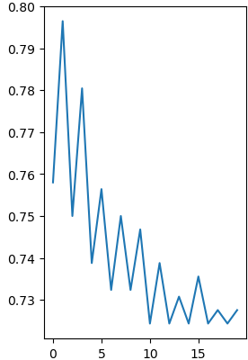
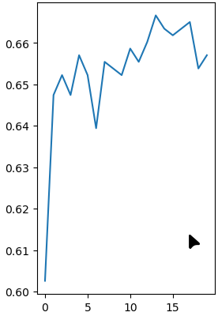

# T-DEV-810

## Introduction

La détection automatisée des pneumonies à partir de radiographies thoraciques constitue un enjeu majeur pour améliorer le diagnostic médical. Ce rapport, réalisé dans le cadre du module **T-DEV-810**, explore différentes approches de classification supervisée pour distinguer trois classes : **Normal**, **Pneumonie Bactérienne** et **Pneumonie Virale**.

L’objectif est d’évaluer et comparer plusieurs modèles classiques — **régression logistique**, **régression linéaire**, **Random Forest**, et **PCA combinée à une régression logistique** — en termes de précision, complexité et capacité de généralisation.

La problématique est la suivante :
**Quelle méthode de classification permet d’obtenir la meilleure précision tout en conservant une certaine interprétabilité et une complexité raisonnable pour le traitement des images médicales ?**

## Table des Matières

---

## 1. Le jeu de données

### Où le trouver ?
Les radiographies se trouvent  dans le dans le dossier [chest_Xray](https://github.com/EpitechMscProPromo2026/T-DEV-810-STG_10/tree/main/chest_Xray):

avec **5216** radiographies de train dont:
  - 1341 radiographies saines
  - 3875 radiographies de pneumonies

et **624** radiographies de tests dont:
  - 234 radiographies saines
  - 390 radiographies de pneumonies

Donc on a environs 88% des images pour l'entraînement et 12% pour les tests

### Comment obtenir les libellés ?

```
.
├── test/
│   ├── NORMAL/
│   │   └── nom_image
│   └── PNEUMONIA/
│       └── nom_image_(virus/bacterie)
└── train/
    ├── NORMAL/
    │   └── nom_image
    └── PNEUMONIA/
        └── nom_image_(virus/bacterie)
```

Les images se trouvant dans les dossiers *NORMAL* sont des radiographies saines, les dossiers *PNEUMONIA* sont des radiographies de pneumonies et le type de la pneumonies se trouve dans le nom de l'image (ex: image_241_virus.jpg)

## Transformations des données pour les Algorithmes

Pour permettre une comparaison entre chaque algorithme on a essayé d'avoir le plus souvent les mêmes traitement d'images à chaque fois, des précisions seront présentes si pour l'algorithme on a fait d'autres transformations.

Les algorithmes demandent d'avoir le même nombre de features[^1] ce qui nous oblige a redimensionné les images dans une taille fixe, pour tous les algorithmes les images sont redimensionné entre 400x400 et 100x100 pixels dont le plus performant étant 128x128.

On a obtenu ce chiffre en testant différentes tailles sur les algorithmes.

Puis les images sont flatten[^2] car le modèle ne prends pas les tableaux à plusieurs dimensions.

> Une image en nuance de gris contient 2 dimensions (position x et y du pixel qui contient la valeur du gris dans le pixel)
> Une image en couleur contient 3 dimensions (position x et y qui contiennent un tableau contenant les valeurs pour les couleurs RGB (Red-Blue-Green))

[^1]: Une feature est un pixel de notre image qu'on souhaite passer dans le modèle
[^2]: Transformations d'un tableau avec X dimensions en un tableau d'une seule dimension 

---

A partir de maintenant on va aborder les modèles tester, les résultats et une observation de nos résultats.
Pour commencer tous les algorithmes en dehors du deep learning proviennent de la librairie `sklearn` qui implémente 
directement les algorithmes facililant la mise en place.

## Algorithme KNearest-Neighbors (KNN)

### Explication


### Résultat 

#### Meilleures Résultats

| Paramètres | type classification | Accuracy |
| ---------- | ------------------- | -------- |
| 2          | binaire             | 79%      |
| 12         | ternaire            | 66%      | 

#### Courbes des précisions en fonction du nombre de voisin
##### Binaire


##### Ternaire


### Observation 

L'algorithme pourrait être plus intéressant sur des données qui sont plus différentes les une des autres, par exemple une IA qui permet de voir quel
animal est représenté sur l'image car un chien et un chat ont des grandes différences. 
Dans notre cas, les images n'ont pas d'énormes différences visibles, une personne qui n'est pas du domaine n'arriverai pas à dire laquel est une pneumonie ou pas. 

En plus KNN prends énormément de RAM car quand il cherche à prédire une image, il est obligé de mettre en mémoire chaque point de chaque image pour faire les calculs de distance le plus rapidement possible.

On remarque sur les résultats que l'algorithme s'en sort moins bien avec la classification entre virale et bactérienne, car la différence est moins visible qu'entre une personne ayant une pneumonie et une personne qui n'en a pas.

## Détection de la Pneumonie via Random Forest

### Explication

### Hyperparamètre

Pour optimiser mes hyperparamètres j'ai utilisé une fonction de `sklean` se nommant `GridSearchCV` qui prends en paramètres une liste de dictionnaires associant 
le nom de l'hyperparamètre avec une liste de valeur possible. Ainsi cette fonction va exécuter automatiquement le modèle avec les différents hyperparamètres 
et retourne les hyperparamètres qui ont mieux performés.

#### Meilleures Hyperparamètres

Les meilleurs paramètres obtenus sont :

| Hyperparamètre       | Valeur sélectionnée |
| --------------------- | --------------------- |
| `criterion`         | `entropy`           |
| `max_depth`         | `None`              |
| `max_features`      | `sqrt`              |
| `min_samples_split` | `10`                |
| `n_estimators`      | `300`               |

Cette configuration a permis d’atteindre une **précision d’environ 78 %** sur le jeu de test.

### Évaluation du Modèle

L’évaluation a été réalisée à l’aide des métriques classiques :

- **Matrice de confusion** : permet d’observer les erreurs entre les trois classes
- **Classification Report** : précision, rappel, F1-score par classe
- **Analyse d’erreurs** : des exemples d’images mal classées peuvent mettre en lumière certaines limitations (chevauchement visuel entre VIRUS et BACTERIA, par exemple)

### Observation

Le modèle Random Forest constitue une **première approche simple et interprétable** pour classifier des radiographies pulmonaires.
Toutefois, les performances sont limitées (78 % de précision) comparées à d’autres méthodes.
Cela s’explique par l’absence de prise en compte de la structure spatiale des images.
L’utilisation de modèles plus complexes, tels que les **réseaux convolutifs (CNN)**, semble inévitable pour améliorer significativement la performance sur ce type de données.


## 4. Détection de la Pneumonie via Régression Logistique

### 4.1 Introduction

Ce projet a pour objectif de classifier des radiographies thoraciques en trois catégories : **Normal**, **Pneumonie Bactérienne**, et **Pneumonie Virale**.
Nous utilisons ici un modèle de **régression logistique multinomiale**, approche linéaire classique bien connue pour sa robustesse et sa simplicité.

### 4.2 Exploration des Données

Le dataset est structuré en trois sous-ensembles :

- **train**
- **val**
- **test**

Les images sont étiquetées dans les classes `NORMAL`, `BACTERIA`, et `VIRUS`.
Une exploration visuelle (affichage d’images et histogrammes RGB) permet de mieux cerner la distribution des intensités et couleurs dans le jeu de données.

### 4.3 Prétraitement des Données

Les étapes de transformation incluent :

- **Redimensionnement** des images à 128x128 pixels
- Conversion BGR → RGB
- Encodage des étiquettes (`NORMAL` → 0, `BACTERIA` → 1, `VIRUS` → 2)
- Séparation en `X` (features) et `y` (labels)

### 4.4 Extraction des Caractéristiques

Les images matricielles sont aplaties en **vecteurs unidimensionnels** pour être compatibles avec le modèle de régression.

- Aplatissement en vecteurs de taille `(128*128*3,)`
- Optionnel : **normalisation des pixels** dans l’intervalle [0, 1]

### 4.5 Modélisation avec Régression Logistique

Le modèle est implémenté via `sklearn.linear_model.LogisticRegression`, avec les caractéristiques suivantes :

- Mode `multinomial` (classification multi-classe)
- Régularisation de type `L2` (ridge)
- Solveur `saga` ou `lbfgs` selon les cas
- Entraînement sur `train`, validation sur `val`, test final sur `test`

### 4.6 Évaluation du Modèle

Les performances sont analysées à l’aide de :

- **Matrice de confusion**
- **Classification report** : précision, rappel, F1-score par classe
- **Analyse des erreurs** : examen de cas mal classés pour comprendre les limites du modèle

### 4.7 Conclusion

La **régression logistique multinomiale** constitue une **baseline solide et interprétable** pour des tâches de classification d’images.
Toutefois, ses performances sont limitées dès que la structure spatiale des images devient déterminante, ce qui est le cas pour les radiographies médicales.
Des techniques comme les **réseaux de neurones convolutifs (CNN)** devraient être privilégiées pour améliorer significativement les résultats.


## 1. Détection de Pneumonies via PCA et Régression Logistique
### 1.3 Prétraitement des Images

Les images ont subi les étapes suivantes :

- Conversion en niveaux de gris et aplatissement en vecteurs
- Redimensionnement initial à 400x400 pixels (baseline), puis expérimentations avec tailles plus petites (200x200, 128x128, 100x100)
- Normalisation des pixels entre 0 et 1 pour faciliter l’entraînement et la convergence des modèles

### 1.4 Réduction de Dimension avec PCA

La PCA est appliquée pour réduire la dimensionnalité des vecteurs d’images tout en conservant la majorité de la variance. Différentes configurations ont été testées :

- Nombre de composantes défini par la variance expliquée (n_components=0.95, 0.90, 0.99)
- Nombre fixe de composantes (100, 300)

L’objectif est de trouver un compromis entre richesse des données conservées et complexité du modèle.

### 1.5 Modélisation par Régression Logistique

Le classifieur utilisé est une régression logistique multiclasse, entraînée sur les données projetées par la PCA.

Plusieurs variantes ont été évaluées pour optimiser les performances :

- Nombre maximal d’itérations (max_iter)
- Type de pénalité (L1 ou L2)
- Méthode de résolution (solver)
- Force de régularisation (C)

### 1.6 Expérimentations et Résultats

#### 1.6.1 Impact de la taille des images

| ID       | Taille Image | Description                          | Accuracy |
| -------- | ------------ | ------------------------------------ | -------- |
| Baseline | 400x400      | Réglage de base                     | 82%      |
| V1       | 200x200      | Réduction de la taille, plus rapide | 82%      |
| V2       | 128x128      | Taille intermédiaire                | 80%      |
| V3       | 100x100      | Compression agressive                | 85%      |

**Observation :** La réduction agressive à 100x100 améliore légèrement la précision, probablement par effet de régularisation ou réduction du bruit.

#### 1.6.2 Influence du nombre de composantes PCA (avec image_size=100x100)

| ID | n_components          | Description                         | Accuracy |
| -- | --------------------- | ----------------------------------- | -------- |
| P0 | 0.95 (variance)       | Baseline                            | 85%      |
| P1 | 0.90 (moins de comp.) | Moins de composantes, plus rapide   | 86%      |
| P2 | 0.99 (plus riche)     | Conserve davantage d’information   | 86%      |
| P3 | 100 (fixe)            | Nombre fixe de composantes          | 84%      |
| P4 | 300 (très riche)     | Risque de bruit ou surapprentissage | 86%      |

#### 1.6.3 Réglages du modèle de régression logistique

| ID | Paramètres                 | Description                                    | Accuracy |
| -- | --------------------------- | ---------------------------------------------- | -------- |
| M0 | max_iter=1000               | Baseline                                       | 86%      |
| M1 | max_iter=2000               | Plus d’itérations                            | 84%      |
| M2 | solver='saga'               | Optimisé pour grands jeux de données         | 85%      |
| M3 | penalty='l1', solver='saga' | Régularisation Lasso favorisant la parcimonie | 86%      |
| M4 | C=0.1                       | Régularisation forte, modèle plus simple     | 78%      |
| M5 | C=10.0                      | Faible régularisation, modèle plus flexible  | 84%      |

### 1.7 Synthèse des Meilleures Configurations

| Test ID    | Accuracy | Commentaires                                    |
| ---------- | -------- | ----------------------------------------------- |
| V3         | 85%      | Taille image réduite améliore la précision   |
| P1, P2, P4 | 86%      | PCA avec 90%-99% variance conservée optimal    |
| M0, M3     | 86%      | Régression avec L1 et solver 'saga' performant |

### 1.8 Conclusion

L’utilisation combinée de la réduction de dimension par PCA et d’un modèle de régression logistique permet d’atteindre une précision satisfaisante (~86%) pour la classification de radiographies en trois classes.
Les résultats suggèrent qu’une réduction modérée de la taille des images ainsi qu’un choix judicieux du nombre de composantes PCA améliorent les performances.
La régularisation L1 avec solver ‘saga’ aide à obtenir un modèle plus parcimonieux sans perte de précision notable.

Pour aller plus loin, l’intégration de techniques de Deep Learning, notamment les CNN, serait la voie privilégiée pour exploiter pleinement la nature visuelle des images médicales.
## 3. Impact des Paramètres sur la Régression Linéaire

### 3.1 Introduction

Ce modèle explore l’utilisation de la **régression linéaire** pour la classification de radiographies thoraciques en trois catégories : **Normal**, **Pneumonie Bactérienne** et **Pneumonie Virale**.
Contrairement aux classifieurs classiques, les prédictions continues sont **arrondies** et **bornées** pour être mappées sur des classes discrètes (0, 1, 2).

L’objectif est d’évaluer l’influence de certains paramètres — taille d’image, normalisation, intercept — sur les performances du modèle.

### 3.2 Description du Dataset et Prétraitement

Les images sont transformées comme suit :

- Conversion en niveaux de gris
- Aplatissement en vecteurs
- Normalisation des pixels dans l’intervalle [0, 1]
- Redimensionnement (principalement en 128x128, mais d’autres tailles ont été testées)

Les données sont divisées de manière **stratifiée** en 80% pour l’entraînement et 20% pour le test.

### 3.3 Modèle Baseline

Le modèle de base repose sur `LinearRegression()` de `scikit-learn`.
La prédiction continue est arrondie avec `np.round()` puis **clipée** dans l’intervalle [0, 2].

| Paramètre           | Valeur                             |
| -------------------- | ---------------------------------- |
| Modèle              | `LinearRegression()`             |
| Taille des images    | `(128, 128)`                     |
| Mode                 | Niveaux de gris, images aplaties   |
| Normalisation        | Pixels divisés par 255            |
| Jeu de test          | 20% des données, stratifié       |
| Arrondi prédictions | `np.round()` + `np.clip(0, 2)` |

**Accuracy obtenue : 73%**

### 3.4 Expérimentations

#### 3.4.1 Variation de la Taille des Images

| ID | Modification              | Description                              | Résultat (Accuracy) |
| -- | ------------------------- | ---------------------------------------- | -------------------- |
| V1 | `image_size=(64, 64)`   | Taille plus petite, moins de dimensions  | 62%                  |
| V2 | `image_size=(256, 256)` | Taille plus grande, plus d’informations | 71%                  |

**Observation :** Une taille d’image trop réduite nuit à la précision, probablement en raison d’une perte d’information. Une taille supérieure à 128x128 améliore légèrement les performances mais augmente le coût computationnel.

#### 3.4.2 Ajustement de l’Intercept

| ID | Modification            | Description               | Résultat (Accuracy) |
| -- | ----------------------- | ------------------------- | -------------------- |
| M1 | `fit_intercept=False` | Ne pas apprendre de biais | 68%                  |

**Observation :** Supprimer le biais (`intercept`) dégrade la précision. Cela montre son importance dans le bon ajustement des prédictions.

### 3.5 Exemple de Code avec Régression Ridge

```python
from sklearn.linear_model import Ridge
from sklearn.model_selection import train_test_split
import numpy as np

# Entraînement du modèle
model = Ridge(alpha=1.0)
model.fit(X_train, y_train)

# Prédiction
y_pred = model.predict(X_test)

# Arrondi et clipping des prédictions pour correspondre aux classes 0,1,2
y_pred_rounded = np.clip(np.round(y_pred), 0, 2).astype(int)

# Calcul de l'accuracy
accuracy = np.mean(y_pred_rounded == y_test)
print(f"Accuracy: {accuracy:.2f}")
```

### 3.6 Conclusion

La régression linéaire simple, bien que peu adaptée de prime abord à la classification, permet ici d’atteindre une précision correcte (73%).
Les expérimentations montrent :

L’importance de la taille des images : trop petite = perte d’information, trop grande = gain modéré + coût accru

Le rôle essentiel du biais (intercept) dans l’apprentissage

Pour améliorer ces résultats, on pourrait explorer :

Des modèles régularisés (Ridge, Lasso)

Des transformations non linéaires

Des approches neuronales ou convolutives

## 6. Comparatif des Modèles

Synthèse comparative des performances, avantages, inconvénients, tableau récapitulatif, etc.

## 7. Conclusion

Résumé des principaux résultats, enseignements, pistes d’amélioration, perspectives futures.
